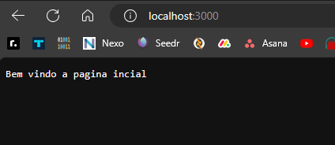

## Objetivo: Criar um servidor HTTP simples que responde a duas rotas diferentes com mensagens diferentes.

**Instruções:**

Crie um novo arquivo JavaScript (por exemplo, server.js) e inicie um novo projeto Node.js.

Use o módulo http para criar um servidor HTTP que escute na porta 3000.

Crie duas rotas diferentes:

Rota 1: Quando um cliente acessa http://localhost:3000/, o servidor deve responder com "Bem-vindo à página inicial!".
Rota 2: Quando um cliente acessa http://localhost:3000/sobre, o servidor deve responder com "Esta é a página 'Sobre nós'.".
Configure as respostas com os cabeçalhos adequados para exibir o conteúdo como texto simples.

Inclua um log no servidor para registrar cada solicitação recebida, exibindo o método HTTP (GET, POST, etc.) e a URL solicitada.

Inicie o servidor e verifique se ele está funcionando corretamente.

### Resolução:

Ao acessar a pagina inicial ela retorna a mensagem: "Bem-vindo à página inicial!"

ao mesmo tempo que um log é inserido no arquivo log.txt

Quando o acesso a pagina sobre nós retorna a mensagem: "Esta página é sobre nós"

um log é inserido no arquivo log.txt logo abaixo do anterior com a data de acesso a pagina sobre

